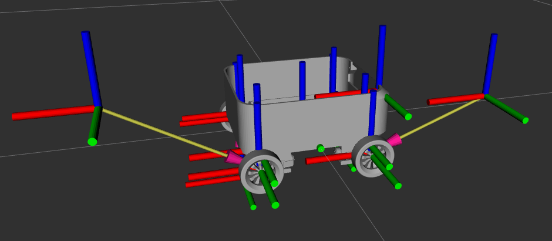
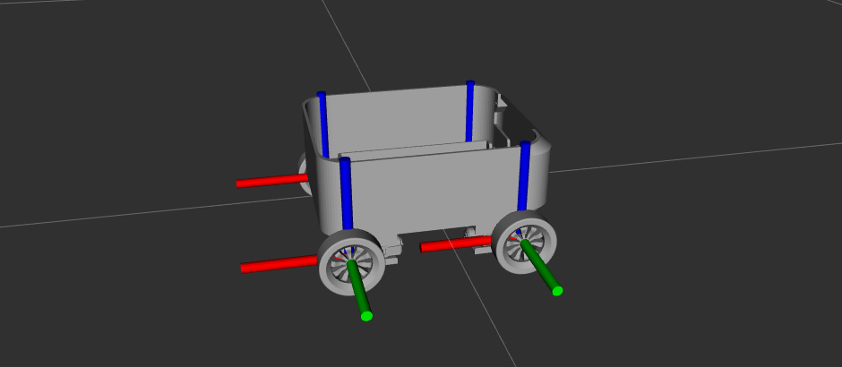

# 🤖 Fusion 360 to URDF

Este repositório ensina como transformar um modelo 3D criado no **Fusion 360** em um arquivo **URDF**, compatível com o simulador **Gazebo**, usado em projetos com **ROS 2**.

Você aprenderá:
- ✅ Como exportar o modelo do Fusion 360;
- ✅ Como configurar um pacote ROS 2;
- ✅ Como organizar os arquivos do projeto;
- ✅ Como resolver erros comuns de simulação.

---

## 📦 Requisitos

| Ferramenta         | Plataforma | Observações                          |
|--------------------|------------|--------------------------------------|
| Fusion 360         | Windows    | Requer o plugin `URDF Exporter`      |
| ROS 2 (Humble, etc)| Ubuntu     | Ambiente para simulação e testes     |

---

## 🛠️ Exportação no Fusion 360

### 🔌 Instalando o Plugin

1. Copie a pasta `URDF_Exporter_Ros2` disponível em:

   ```
   doc/URDF_Exporter_Ros2/
   ```

2. Cole no diretório:

   ```
   C:\Users\{seu_usuário}\AppData\Roaming\Autodesk\Autodesk Fusion 360\API\Scripts
   ```

### 🧩 Preparando o Modelo

> ⚠️ **Importante:** Componentes vinculados a arquivos externos podem causar problemas.

- **Nomenclatura sugerida:**
  - Juntas: `{parte1}_{parte2}_joint`
  - Componentes: `nome_simples`
  - Componente base: `base_link`

- **Evite vínculos externos:**

  Quando há vínculo, o nome do componente ganha versões automáticas:

  

  Quebrando o vínculo, o nome pode ser alterado corretamente:

  

### 📤 Exportando para URDF

1. Acesse no Fusion 360:
   ```
   Utilidades > Complementos > Scripts e Complementos > URDF_Exporter_Ros2
   ```

2. Uma mensagem de sucesso será exibida após a exportação.

---

## 🧪 Configurando o ROS 2

### 📁 Criando o Workspace

```bash
mkdir irrobot_ws
cd irrobot_ws
mkdir src
```

### 📦 Criando o Package

```bash
cd src
ros2 pkg create --build-type ament_python irrobot_description
```

### 📂 Estrutura Esperada

A estrutura do pacote deve ser similar a esta:

```
irrobot_description/
├── config/
│   └── display.rviz
├── irrobot_description/
│   └── __init__.py
├── launch/
│   ├── display.launch.py
│   └── gazebo.launch.py
├── meshes/
│   └── *.stl
├── urdf/
│   ├── irrobot.xacro
│   ├── irrobot.gazebo
│   ├── irrobot.trans
│   └── materials.xacro
├── package.xml
├── resource/
│   └── irrobot_description
├── setup.py
├── setup.cfg
└── test/
```

### ⚙️ Compilando o Projeto

```bash
cd ~/irrobot_ws
colcon build
```

### 🚀 Executando os Launch Files

```bash
# Lança o Gazebo com o robô
ros2 launch irrobot_description gazebo.launch.py

# Abre o RViz com o modelo
ros2 launch irrobot_description display.launch.py
```

---

## ⚠️ Problemas Comuns

### ❌ Junta Desalinhada

Algumas juntas podem não estar centralizadas corretamente. Por exemplo, a junta `wheel_box_motor` pode fazer a roda "orbitar" o motor:



#### ✅ Solução

Ajuste a posição da junta para que o eixo passe pelo centro real da roda/motor. Após o ajuste:



---

## 📚 Conclusão

Com este guia, você será capaz de:

- Exportar robôs do Fusion 360 para URDF;
- Visualizar e simular seu robô no Gazebo e RViz;
- Corrigir erros comuns de modelagem e exportação.

---
